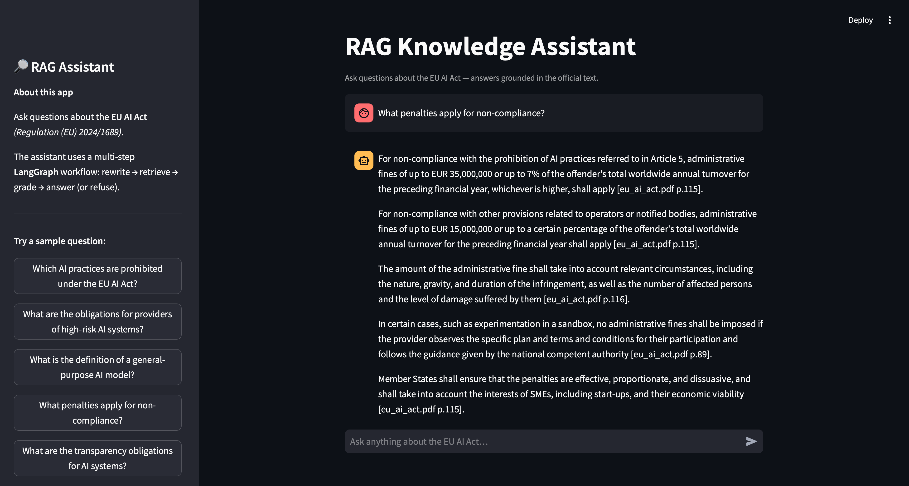
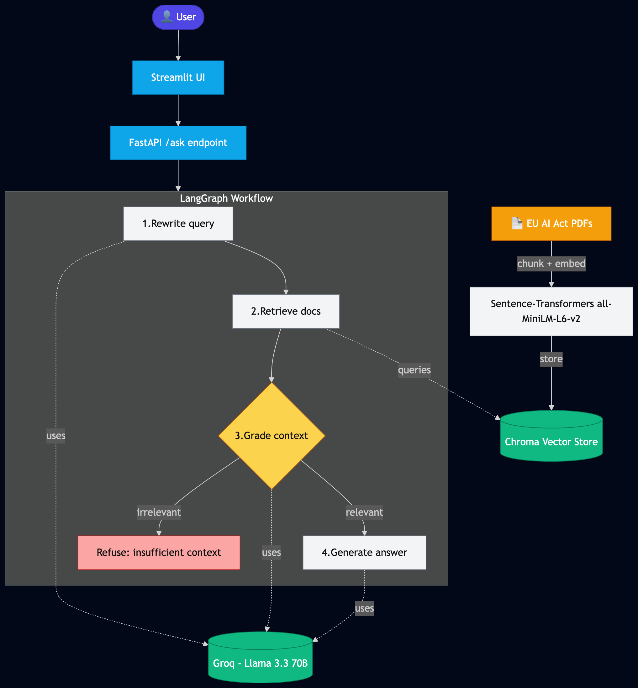
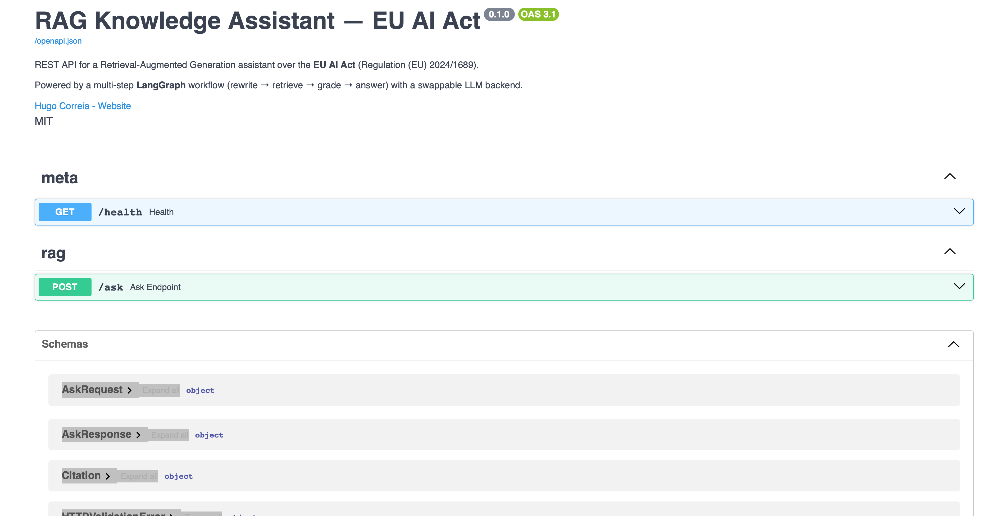

# 🔎 RAG Knowledge Assistant — EU AI Act

> A Retrieval-Augmented Generation (RAG) assistant that answers questions about the **EU AI Act** using a multi-step **LangGraph** workflow, local embeddings, and a swappable LLM backend (**Groq** by default, Azure OpenAI optional).

**[Live demo](https://rag-knowledge-assistant-hc.streamlit.app)** — ask the Act anything in the browser. Every answer carries the citations it stands on, or the assistant refuses cleanly — a measured behaviour, not a hope.

<p align="center">
  
</p>

<p align="center">
  
</p>

<p align="center"><i>Animated preview (above) and static view (below) of the Streamlit chat UI answering questions about the EU AI Act with grounded citations.</i></p>

---

## 🏗️ Architecture

<p align="center">
  
</p>

---

## ✨ What this project does

Ask the assistant questions like:

- *"What are the obligations for providers of high-risk AI systems?"*
- *"Which AI practices are prohibited under the EU AI Act?"*
- *"What is the definition of a general-purpose AI model?"*

The system retrieves the most relevant passages from the EU AI Act, **grades** whether they actually answer the question, and either generates a grounded answer with citations or politely refuses if the context is insufficient.

This makes it more than a "retrieve-and-answer" demo — it's a small but real **AI system with guardrails**.

---

## 🏗️ Architecture

The workflow runs as a small **LangGraph** state machine:

1. **Rewrite** — clean up the user's question for better retrieval
2. **Retrieve** — semantic search over the EU AI Act in a Chroma vector store
3. **Grade** — does the retrieved context actually answer the question?
4. **Answer** — if yes, generate a grounded response with citations; if no, refuse cleanly

This multi-step orchestration is the key difference from a naive RAG pipeline. It reduces hallucinations and makes failures transparent and debuggable.

---

## 🛠️ Stack

| Layer | Tool |
|---|---|
| LLM | **Groq** (Llama 3.3 70B) — swappable to Azure OpenAI via env var |
| Embeddings | `sentence-transformers/all-MiniLM-L6-v2` (local, free) |
| Vector store | **Chroma** (local, persisted) |
| Orchestration | **LangChain + LangGraph** |
| Backend API | **FastAPI** |
| Frontend | **Streamlit** |
| Evaluation | Custom Q&A test set + retrieval precision + LLM-as-judge |

---

## 🚀 Quickstart

---

## 🔌 REST API

Beyond the Streamlit UI, the same workflow is exposed as a typed REST API for integration with other applications.

```bash
make api          # launches at http://localhost:8000
```

Then visit **`http://localhost:8000/docs`** for the auto-generated interactive Swagger UI:

<p align="center">
  
</p>

**Example: ask a question via `curl`**

```bash
curl -X POST http://localhost:8000/ask \
  -H "Content-Type: application/json" \
  -d '{"question": "Which AI practices are prohibited under the EU AI Act?"}'
```

**Response shape:**

```json
{
  "question": "Which AI practices are prohibited under the EU AI Act?",
  "answer": "The EU AI Act prohibits the following practices: ...",
  "citations": [
    {
      "source": "eu_ai_act.pdf",
      "page": 51,
      "similarity": 0.640,
      "snippet": "..."
    }
  ],
  "was_answered": true
}
```

**Endpoints:**

| Method | Path     | Purpose                                  |
|--------|----------|------------------------------------------|
| `GET`  | `/`      | Redirects to `/docs`                     |
| `GET`  | `/health`| Liveness probe                           |
| `POST` | `/ask`   | Ask a question, get a grounded answer    |
| `GET`  | `/docs`  | Interactive Swagger UI                   |

```bash
# 1. Clone and install dependencies
git clone https://github.com/hugocorreia123/rag-knowledge-assistant.git
cd rag-knowledge-assistant
make install
source .venv/bin/activate

# 2. Add your Groq API key (free at https://console.groq.com)
cp .env.example .env
# edit .env and set GROQ_API_KEY=...

# 3. Download the EU AI Act and build the vector store
make ingest

# 4. Launch the app
make run
```

The Streamlit UI opens at `http://localhost:8501`.

**Other commands:**
- `make graph` — run the LangGraph workflow in the terminal (no UI)
- `make smoke` — smoke-test semantic retrieval
- `make help`  — list all available commands
---

## 📊 Evaluation

The hardest part of building a RAG system is **knowing if it's good**. This project includes a real evaluation suite — not just vibes.

### Methodology

The test set in [`evaluation/test_questions.yaml`](evaluation/test_questions.yaml) contains **21 hand-written cases** covering:

- **18 in-scope questions** across 8 categories (definitions, prohibitions, obligations, transparency, GPAI, penalties, scope, governance)
- **3 out-of-scope questions** the system should refuse (cooking, weather, programming installs)

Each in-scope case specifies:
- `expected_pages` — page numbers in the EU AI Act where the answer should be grounded
- `key_facts` — specific phrases the answer should mention (used as a substring-based faithfulness signal)

### Metrics

Run `make eval` (or `python -m evaluation.evaluate`) to produce four metrics:

| Metric | What it measures |
|---|---|
| **Recall@K** | Fraction of expected pages found in the top-K retrieved chunks |
| **Precision@5** | Fraction of top-5 chunks coming from expected pages |
| **Faithfulness** | Fraction of `key_facts` substring-matched in the generated answer |
| **Refusal accuracy** | Fraction of out-of-scope questions correctly refused |
| **Median latency** | End-to-end seconds per question |

### Calibration workflow

Building a good test set is iterative. The repo includes a zero-LLM diagnostic (`python -m evaluation.diagnose_retrieval`) that runs only the retriever, so `expected_pages` can be calibrated against real retrieval output before spending tokens on the full eval. This is how the current test set's page ranges were chosen — including both **recital pages** (the explanatory "whereas" sections) and **article pages** (the operative law), because the EU AI Act discusses each topic in both forms.

### Resilience

The eval is resumable: if it hits a rate limit mid-run, partial progress is checkpointed to `evaluation/.checkpoint.json` and the next `make eval` invocation continues from where it stopped. Rate-limit errors trigger exponential-backoff retries automatically.

### Latest results

Live, machine-generated results live in [`evaluation/results.md`](evaluation/results.md) — re-run periodically against the latest code.

> Free-tier LLM quotas (Groq) cap daily evaluation runs at ~100K tokens. The eval is designed to fit within that budget by using a token-efficient direct retrieval-and-answer path (`ask_direct` in `src/graph.py`), skipping the LangGraph rewrite and grade nodes during measurement.

## 🔄 Swapping the LLM provider

The system reads `LLM_PROVIDER` from the environment. Supported values:

- `groq` (default — free, Llama 3.3 70B)
- `azure_openai` (production — paid)
- `openai` (paid)

Switching providers is a single env variable change — no code edits.

---

## 📁 Repository layout

```
src/             # core pipeline (ingestion, retriever, graph, api)
app/             # Streamlit UI
evaluation/      # test questions + evaluation script
tests/           # unit tests
docs/            # architecture diagram, screenshots, demo GIF
scripts/         # one-command setup scripts
data/            # EU AI Act PDFs + vector store (gitignored)
```

---

## 🧠 Why this design

A few choices worth flagging for anyone reviewing the code:

- **LangGraph over plain LangChain.** The explicit state machine makes the workflow inspectable and debuggable. Each node is independently testable.
- **Local embeddings.** `all-MiniLM-L6-v2` is small (90 MB), fast on CPU, and good enough for legal text. Keeps the project provider-independent and free to run.
- **Grade-before-answer.** Most public RAG demos answer no matter what was retrieved, which is exactly how you get hallucinations. The grader node is what makes this trustworthy.
- **Evaluation set checked into the repo.** The hardest part of building RAG is *knowing* if it's good. Writing the eval first forces honesty.
- **Provider abstraction.** The same code runs on free Groq for the public demo and on enterprise Azure OpenAI in production — useful pattern, almost zero code.

---

## ⚠️ Known limitations

A few honest caveats worth flagging — they shape the roadmap below.

- **PDF extraction artifacts.** EUR-Lex PDFs use letter-spaced typography for print, which causes `pypdf` to split words across spaces (e.g. `fines` extracted as `f ines`, `obligations` as `obli g ations`). This subtly degrades retrieval precision on token-level matches. The graph still answers correctly with citations, but some answers are hedgier than they need to be.
- **Single-document corpus.** Currently scoped to the EU AI Act. Adding the Commission's FAQ and ENISA guidance would expand the answer space.
- **Embedding model size.** `all-MiniLM-L6-v2` is fast and free, but a larger embedder (e.g. `BAAI/bge-large-en-v1.5`) would likely give a meaningful precision boost on legal text.

## 🗺️ Roadmap

- Switch PDF parsing to `pdfplumber` or `pymupdf` for cleaner text extraction.
- Hybrid retrieval (BM25 + vector) for better coverage on specific terms (article numbers, monetary figures).
- Reranking with a cross-encoder for the top-20 → top-5 step.
- Multi-document ingestion (EU AI Act + explanatory guidance).

## 📜 License

MIT — see [LICENSE](LICENSE)

---

## 👤 Author

**Hugo Correia** — Data Scientist & ML/AI Engineer
- 🔗 LinkedIn: [linkedin.com/in/hugogncorreia](https://www.linkedin.com/in/hugogncorreia)
- 💼 GitHub: [github.com/hugocorreia123](https://github.com/hugocorreia123)
- ✉️ Hugocorreia55@hotmail.com

> Built as part of a portfolio focused on production-ready data and Generative AI solutions.